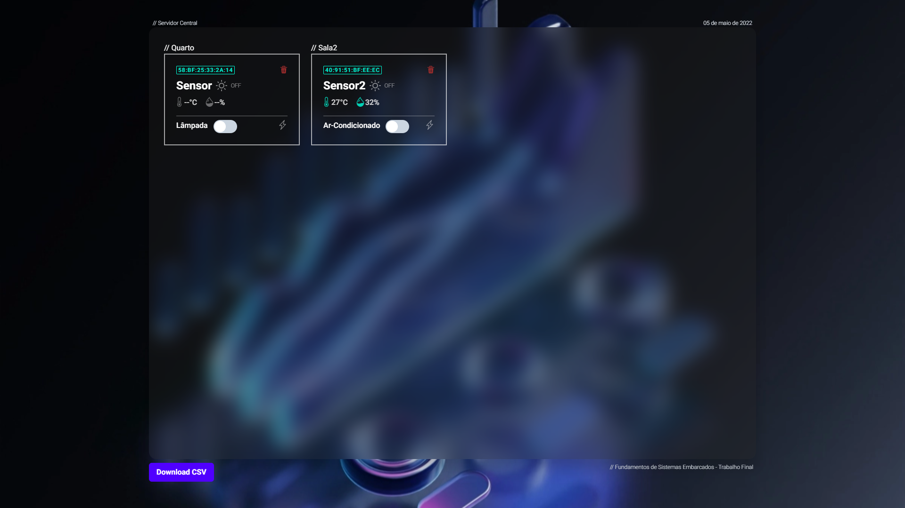

# FSE_Trabalho_3

Repositório para o trabalho 3 da disciplina de Fundamentos de Sistemas Embarcados (FGA-UnB). Enunciado pode ser encontrado neste [link](https://gitlab.com/fse_fga/trabalhos-2021_2/trabalho-final-2021-2).

### Vídeo de demonstração do projeto:

[](https://www.youtube.com/watch?v=-tsbLOtPlkI "FSE Trabalho 3")

***Observações:***

O projeto utiliza o broker público: ```broker.hivemq.com```

- TCP Port: ```1883```
- Websocket Port: ```8000```

## Como executar o projeto

Primeiramente clone o repositório

```bash
git clone https://github.com/igorq937/FSE_Trabalho_3.git
```

Atualize os submódulos do projeto:

```bash
git submodule init
git submodule update
```

Ou apenas utilize:

```bash
git clone --recurse-submodules https://github.com/igorq937/FSE_Trabalho_3.git
```

## Executando Servidor Central

Para executar o servidor central execute:

```bash
cd central
```

```bash	
yarn
# ou
npm install
```

```bash
yarn dev
# ou
npm run dev
```

## Executando Servidor Central com Docker

Para executar o servidor central utilizando Docker execute:

```bash
cd central
docker build -t nextjs-docker .
docker run -p 3000:3000 -p 8000:8000 nextjs-docker
```

## Executando Servidores Distribuídos

Dependências:

* [vscode](https://code.visualstudio.com/)
* [platformio](https://platformio.org/)

```bash
cd distributed
code .
```

Primeiramente acesse o menu de configuração (```Run Menucofig```) para atualizar os dados da conexão wifi.

O menu de configuração do projeto é ```** Project Configuration  --->```

Após configurado siga para o upload do código para a placa Esp32.
